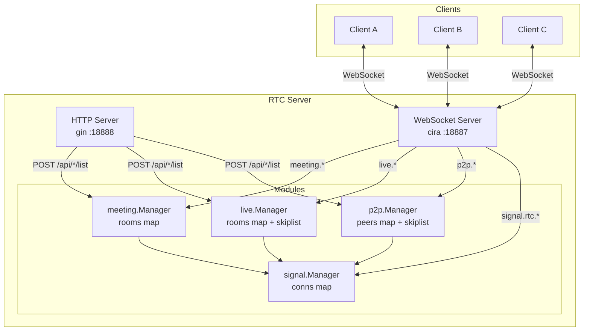
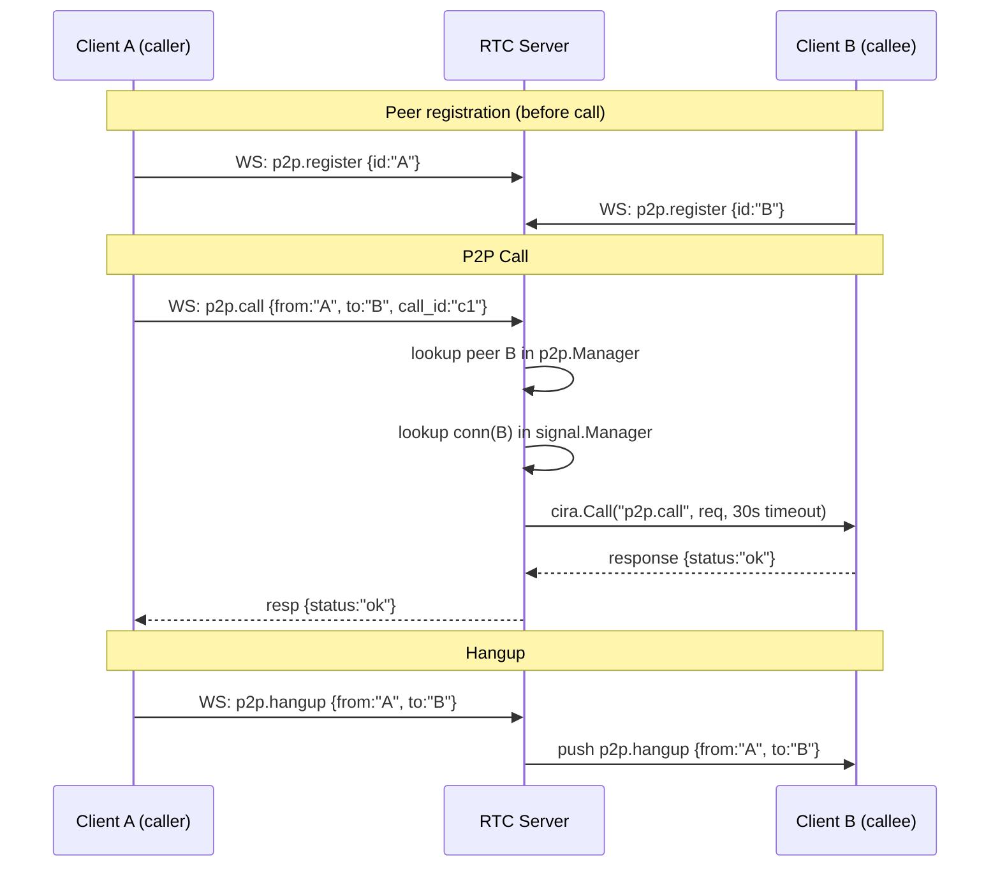
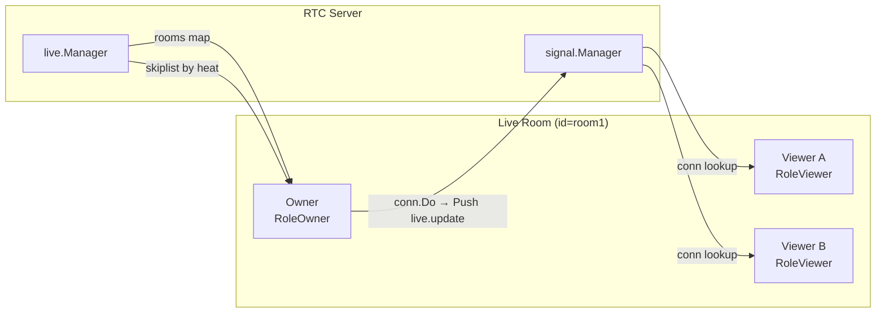
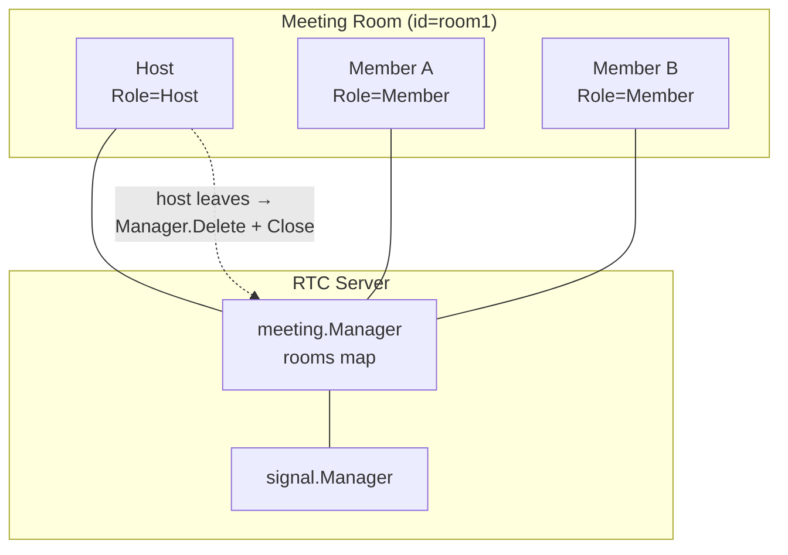
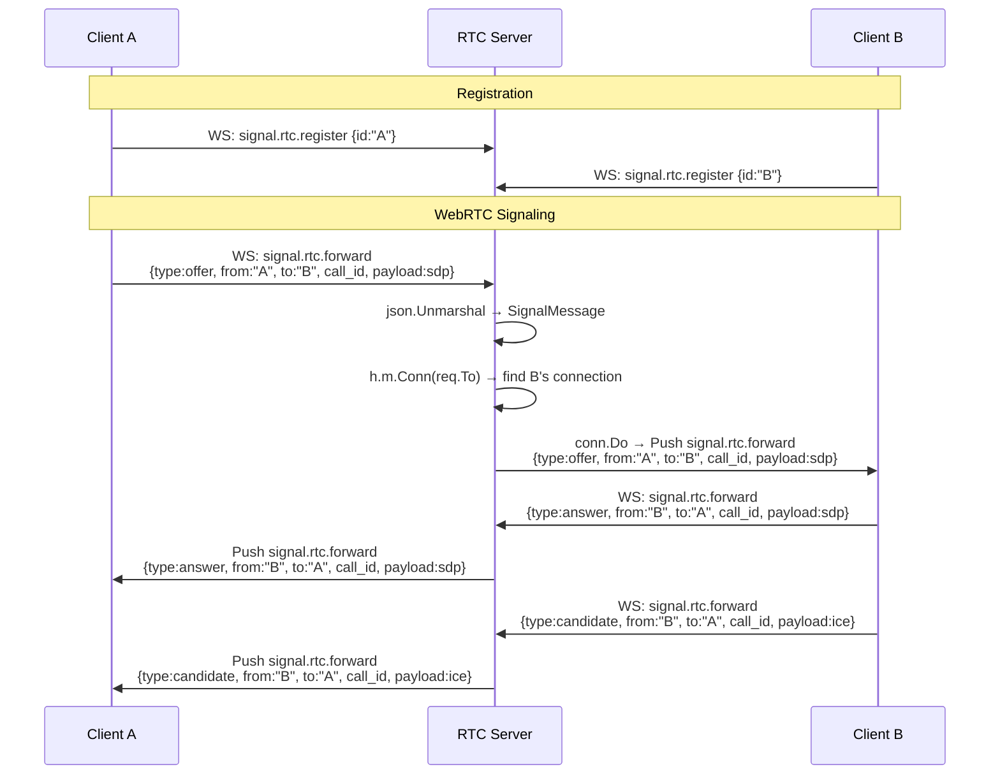

# RTC Server

A real-time communication server built on the [Cira](https://github.com/AtoriUzawa/cira) WebSocket framework, providing WebRTC signaling relay, P2P call management, live streaming rooms, and meeting rooms.
It works together with the RTC Android client: [rtc-android](https://github.com/AtoriUzawa/rtc-android)

## Introduction

RTC Server is a lightweight, single-process signaling server that enables WebRTC-capable clients to discover peers, exchange SDP offers/answers, relay ICE candidates, and manage room-based group communication scenarios. It does **not** process media — it only routes signaling messages between connected clients.

## Features

- **WebRTC Signaling Relay** — Offer, Answer, and ICE Candidate forwarding between peers
- **P2P Call Management** — Initiate and hang up calls with synchronous request-response and configurable timeout
- **Live Streaming Rooms** — Owner/viewer role model with heat-based ranking and cursor pagination
- **Meeting Rooms** — Host/member role model with automatic room teardown when the host leaves
- **Connection Lifecycle** — Automatic cleanup on disconnect via close callbacks
- **Concurrency Safe** — All managers use `sync.RWMutex` for concurrent access

## Architecture



The server exposes two ports: an HTTP API server (gin) for resource listing, and a WebSocket server (cira) for all real-time signaling. Four internal modules share a single `signal.Manager` that maps client IDs to their WebSocket connections.

## Project Structure

```
rtc-server/
├── cmd/main.go                       # Entry point
├── internal/
│   ├── app/app.go                    # Module assembly and server startup
│   ├── signal/                       # WebRTC signaling relay
│   │   ├── manager.go                # Connection registry (map[id]*cira.Conn)
│   │   ├── handler_ws.go             # WS: register, unregister, forward
│   │   ├── model.go                  # RegisterReq, UnRegisterReq
│   │   ├── protocol.go               # SignalMessage, Type (offer/answer/candidate)
│   │   ├── module.go                 # Module composition
│   │   └── router.go                 # Route: signal.rtc.*
│   ├── p2p/                          # P2P call management
│   │   ├── manager.go                # Peer registry (map + skiplist)
│   │   ├── service.go                # Call / Hangup logic
│   │   ├── handler_ws.go / handler_http.go
│   │   ├── model.go                  # Peer
│   │   ├── dto.go                    # CallReq, HangupReq, ListReq/Resp, PeerDTO
│   │   ├── module.go / router.go
│   ├── live/                         # Live streaming rooms
│   │   ├── manager.go                # Room registry (map + skiplist by heat)
│   │   ├── service.go                # Create / Join / Leave + broadcast
│   │   ├── model.go                  # Room, RoomMember, RoomItem
│   │   ├── dto.go                    # CreateReq, JoinReq, LeaveReq, RoomDTO
│   │   ├── handler_ws.go / handler_http.go
│   │   ├── module.go / router.go
│   ├── meeting/                      # Meeting rooms
│   │   ├── manager.go                # Room registry (map only)
│   │   ├── service.go                # Create / Join / Leave + broadcast
│   │   ├── model.go                  # Room, RoomMember (Host/Member roles)
│   │   ├── dto.go                    # CreateReq, JoinReq, LeaveReq, RoomDTO
│   │   ├── handler_ws.go / handler_http.go
│   │   ├── module.go / router.go
│   ├── router/router.go              # Aggregated route registration
│   └── transport/
│       ├── httpx/                    # HTTP JSON bind + response helpers
│       └── wsx/                      # WS JSON bind + response helpers
└── pkg/
    ├── skiplist/                     # Generic skip list
    ├── xerror/                       # Error types with code/message
    ├── heap/                         # Binary heap (unused)
    ├── xlog/                         # zap logger (unused)
    ├── jwt/                          # JWT utilities (unused)
    ├── redis/                        # Redis client (unused)
    └── idgen/                        # ID generator (unused)
```

## P2P Call

P2P calling uses cira's synchronous `Call()` primitive — the server sends a request to the callee and blocks until a response arrives or the timeout fires.



**Key implementation details:**
- `Call()` blocks with a 30-second timeout (`ctx.Timeout = 30 * time.Second`)
- Timeout returns `{"status": "timeout"}` to the caller
- Offline peer returns `{"status": "offline"}`
- Peer lookup: `p2p.Manager.Peer(id)` then `signal.Manager.Conn(id)`

**Peer list (HTTP):**
```
POST /api/p2p/list  {cursor, limit}
→ {list: [{id, nickname}], next_cursor}
```
Paginated via skip list, limit clamped to [1, 10].

## Live Streaming

Live rooms use a **skiplist ranked by heat** (`member count × 10`) with cursor-based pagination, and broadcast member changes to all participants.



**Room lifecycle:**
```
Owner creates → room joins RoleOwner → OnClose deletes room
Viewer joins  → room joins RoleViewer → OnClose leaves room
Owner leaves  → Manager.Delete + room.Close (all members cleared)
```

**Heat ranking:**
- `Heat = len(members) * 10`
- Skiplist comparator: `higher heat first, then lower ID first`
- Cursor format: `"{id}|{heat}"`

**Broadcast on member change:**
```
live.update pushed to all room members via signal.Manager.Conn(memberID).Do()
```

**Room list (HTTP):**
```
POST /api/live/list  {cursor, limit}
→ {list: [{id, title, owner_id, count}], next_cursor}
```

## Meeting

Meeting rooms use a simpler flat-map model without ranking. The key difference from live: when the **host leaves**, the entire room is destroyed.



**Key differences from Live:**

| | Live | Meeting |
|---|---|---|
| Ranking | Skiplist by heat | None (map) |
| Pagination | Cursor-based | Full list |
| Roles | Owner / Viewer | Host / Member |
| Room destroy | Owner leaves | Host leaves |
| Create params | ID + Title | ID only |

**Meeting list (HTTP):**
```
POST /api/meeting/list  (no pagination)
→ {id: {id, host_id, members: {id: {id, role}}}}
```

## Signaling Flow

WebRTC signaling messages (SDP offers, answers, ICE candidates) are relayed through the `signal` module. The server acts as a transparent forwarder — it never inspects or modifies the SDP/ICE payload.



**SignalMessage protocol:**
```json
{
    "type": "offer|answer|candidate",
    "from": "sender-id",
    "to": "target-id",
    "call_id": "correlation-uuid",
    "payload": { }
}
```

The `payload` field carries the raw SDP or ICE candidate data as JSON. The server never deserializes it — only the `type`, `from`, and `to` fields are parsed for routing.

## Quick Start

### Prerequisites

- Go 1.25+

### Install and Run

```bash
git clone https://github.com/AtoriUzawa/rtc-server
cd rtc-server
go run ./cmd
```

The server starts:
- HTTP API on `:18888`
- WebSocket on `:18887`

### Client Registration

Connect to `ws://localhost:18887/ws` and send:

```json
{"route": "signal.rtc.register", "type": "request", "id": "1", "data": {"id": "alice"}}
```

### Initiate a P2P Call

```json
{"route": "p2p.call", "type": "request", "id": "2", "data": {"from": "alice", "to": "bob", "call_id": "c1"}}
```

### Create a Live Room

```json
{"route": "live.create", "type": "request", "id": "3", "data": {"id": "room1", "title": "My Stream"}}
```

## License

MIT
